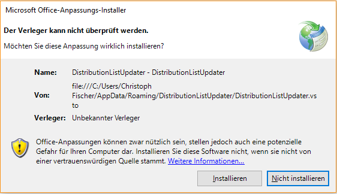
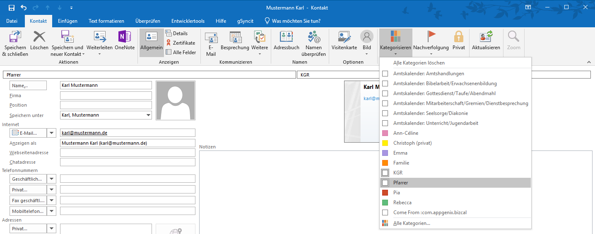
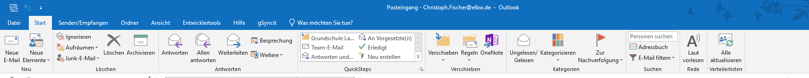
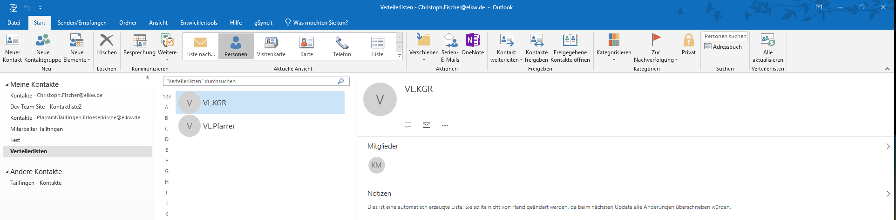

DistributionListUpdater
=======================

Outlook-Addin zum automatischen Erstellen von Verteilerlisten

Autor: Christoph Fischer, christoph.fischer@elkw.de

## Einführung
Verteilerlisten unter Outlook leiden unter zwei grundsätzlichen Problemen:

1. Bestehende Outlookkontakte können zwar zu einer Verteilerliste hinzugefügt werden, nachfolgende Änderungen an den Kontaktdaten werden aber nicht automatisch übernommen. Die Möglichkeit, eine Verteilerliste zur Bearbeitung zu öffnen und anschließend zu "aktualisieren" ist bie einer großen Anzahl von Verteilerlisten keine zufriedenstellende Lösung.
2. Verteilerlisten können nicht zu einer Kontaktliste auf Sharepoint hinzugefügt und damit auf mehreren Rechnern synchron gehalten werden. Verteilerlisten können nur in lokalen (bzw. auf Exchange gespeicherten) Kontaktordnern angelegt werden.

Das vorliegende Addin bietet einen Lösungsansatz dazu. Nach der Installation legt es einen neuen, lokalen Kontaktordner
mit dem Titel "Verteilerlisten" an. Durch einen einzigen Klick im Menüband werden alle verfügbaren Kontakte auf zugeordnete Kategorien durchsucht. Zu jeder Kategorie wird automatisch eine Verteilerliste aufgebaut. Ein erneuter Klick im Menüband aktualisiert alle diese Listen.

## Installation

1. Laden Sie das Setup-Programm zum Addin hier unter [Releases](https://github.com/potofcoffee/DistributionListUpdater/releases) herunter.
2. Beenden Sie Outlook, falls es aktuell ausgeführt wird.
3. Führen Sie das Setup-Programm aus und übernehmen Sie die vorgeschlagenen Einstellungen.
4. Starten Sie Outlook. Falls Sie die folgende Sicherheitsabfrage (nur beim ersten Start nach der Installation) sehen, klicken Sie auf "Installieren":

## Bedienung

1. Ordnen sie ihren Kontakten beliebige Kategorien zu.

2. Klicken Sie im Bereich "Verteilerlisten" des Menübands auf die Schaltfläche "Alle aktualisieren". (Der Bereich "Verteilerlisten" erscheint unter dem Reiter "Start", wenn Sie sich im Bereich E-Mails oder Kontakte von Outlook befinden).

3. Im Kontaktordner "Verteilerlisten finden Sie ihre neuen Verteilerlisten. Zum einfacheren Auffinden bei der Adresseingabe wird dem Titel der Kategorie jeweils "VL." vorangestellt.

## Wichtige Informationen

1. Die automatisch erzeugten Listen werden bei jedem Klick auf die Schaltfläche "Alle aktualisieren" gelöscht und neu erstellt. Manuelle Änderungen an der Verteilerliste gehen dabei verloren. Bitte nehmen Sie Änderungen nur direkt an den Kontakten bzw. deren Kategoriezuweisungen vor.
2. Kontakte mit Kategorien können über Sharepoint zwischen mehreren Benutzern synchron gehalten werden. Dies ist grundsätzlich auch auf dem ELKW-Sharepoint möglich. Dazu muss die Einrichtung einer "Kontaktliste" beantragt werden. Bitte beachten Sie, dass in der Standardeinstellung nur bestimmte Kontaktdaten synchronisiert werden. Das Feld "Kategorien" gehört nicht dazu. Auf dem Sharepoint ist es daher nötig, dieses (und evtl. weitere benötigte Felder) erst hinzuzufügen. Im Fall des ELKW-Sharepoints muss dies durch die Datagroup geschehen.

